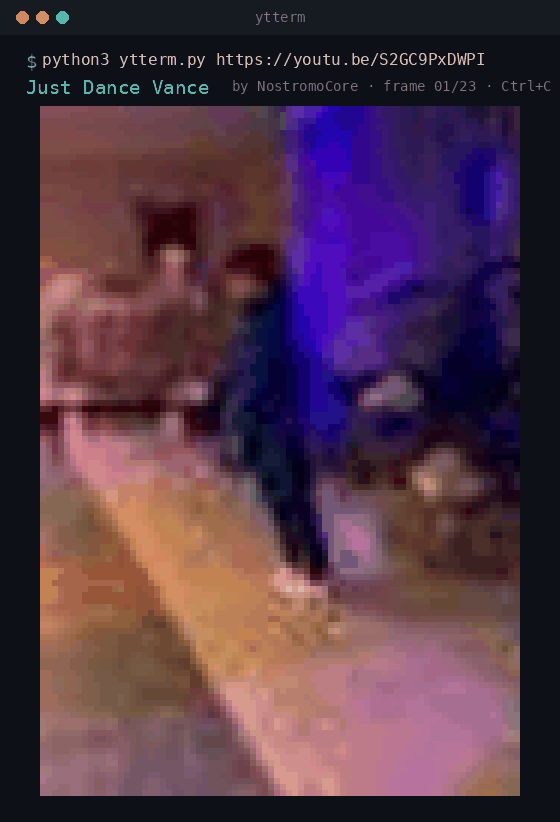

# ytterm — YouTube storyboards as terminal ASCII art

Play any YouTube video's storyboard as a colored ASCII art animation, right in your terminal.

## Demo

`ytterm` playing [*Just Dance Vance*](https://youtube.com/shorts/S2GC9PxDWPI) by NostromoCore as truecolor half-block art:



> The demo is rendered from the video's public storyboard frames — the same low-resolution seek-bar previews `ytterm` fetches at runtime. That's why it's pixelated: it's ~1 frame per second of source, blown up into terminal blocks. See [Subject isolation](#subject-isolation) for the `--isolate` flag that drops the background.

## How it works

YouTube exposes publicly accessible **storyboard images** — the little preview thumbnails you see when hovering over the seek bar. `ytterm` fetches those from YouTube at runtime, slices them into frames, converts them to ANSI-colored character art, and animates them in your terminal.

**No video is downloaded, and no video content is stored in this repository.** Frames are fetched on your machine, from the same public endpoint your browser uses, each time you run the tool.

## Quick start

```bash
pip install Pillow

python3 ytterm.py https://www.youtube.com/watch?v=VIDEO_ID
python3 ytterm.py https://www.youtube.com/shorts/VIDEO_ID --fps 10

# isolate just the person from the background (transparent terminal bg)
pip install rembg onnxruntime
python3 ytterm.py URL --isolate
```

Press **Ctrl+C** to stop.

## Options

| Flag | Description | Default |
|------|-------------|---------|
| `--fps N` | Playback speed in frames per second | 8 |
| `--width N` | Output width in columns | terminal width |
| `--height N` | Output height in rows | terminal height |
| `--level N` | Storyboard quality level (0 = lowest) | highest available |
| `--no-loop` | Play once and exit | loops forever |
| `--no-chafa` | Force the built-in renderer | uses chafa if installed |
| `--isolate` | Remove background, keep only the largest person/subject | off |

## Subject isolation

With `--isolate`, each frame is run through [rembg](https://github.com/danielgatis/rembg)'s human-segmentation model (U²-Net). The largest connected foreground blob is kept and everything else becomes transparent, so the terminal background shows through and you see just the subject looping.

First run downloads the model (~176 MB) to `~/.u2net/`. Subsequent runs are instant.

## Rendering

Two renderers are supported:

- **[chafa](https://hpjansson.org/chafa/)** (optional, auto-detected) — highest quality, uses block/border symbols and 240 colors. Install with `sudo apt install chafa` or `brew install chafa`.
- **Built-in half-block renderer** — zero extra dependencies beyond Pillow, renders with truecolor U+2580 half blocks.

## Requirements

- Python 3.8+
- [Pillow](https://pypi.org/project/Pillow/) (`pip install Pillow`)
- [chafa](https://hpjansson.org/chafa/) (optional, for nicer output)
- [rembg](https://pypi.org/project/rembg/) + onnxruntime (optional, only for `--isolate`)

## Notes & limitations

- Storyboards are low-resolution preview images (~1 frame per second of source video), so playback has a stylized, pixelated aesthetic — that's the charm.
- Works for most public videos. Private, age-restricted, or region-locked videos won't expose a storyboard.
- This tool does not download, decrypt, or redistribute video streams. It only reads the public seek-bar preview images YouTube serves to every visitor.

## License

MIT — see [LICENSE](LICENSE). Video content referenced belongs to its respective creators.
